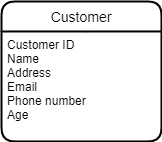
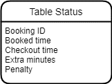

# Databases-Year2Sem1
Databases Year 2 Semester 1 final CA project

# Case Study
<p>
    Burger Shack is a franchise with a chain of restaurants around Ireland. Due to COVID-19 protocols for <br>
    contract tracing, the company needs to create a database that can store relevant details on customers, <br>
    waiting staff and managers at every restaurant branch around the country. <br>
    Each Burger Shack restaurant has a unique numeric restaurant identifier, address and a phone number. <br> 
    Customers who wish to book a table can either make a booking online, by phone or walk into one of the <br>
    restaurants and talk to a manager who can complete the table booking with them in person. <br>
    When a customer books a table at any Burger Shack restaurant, they must provide the following <br>
    information: their name, address, and email address each of which will be stored and cannot be missing. <br>
    The customer must also provide their age which must be over 18. The customer is assigned a unique <br>
    identifier, customer number. <br><br>
    The main customer making the booking is also assigned a booking receipt which includes a booking ID <br>
    number and details of the time of the table booking and number of people at the table. Due to COVID <br>
    restrictions, there cannot be more than 6 people at a table and the table cannot be booked for more <br>
    than 2 hours. A customer can have many bookings with Burger Shack but each booking is for one <br>
    customer. <br><br>
    Each table in every restaurant has a unique number and details of the type table and its location in the <br>
    restaurant. There are four types of table (2, 4, 6 and 8 seater) and 2 locations (window or interior). <br>
    When the party arrive at the restaurant, they are shown to their table and details of each person at the <br>
    table must be recorded and stored in the database for contact tracing. The table number, name, email <br>
    address, phone number of every other guest (apart from the main customer who has already given this <br>
    information) must be provided. <br><br>
    The details of the waiter and manager who served the table must also be recorded. Burger Shack Staff <br>
    are assigned to a particular restaurant branch, their location is stored as part of their employment <br>
    record. All restaurant staff have a unique identifier. Their name, address, phone number, email address, <br>
    date of birth and start date of employment Burger Shack are also stored. All staff email addresses must <br>
    be their company email (ending with @burgershack.com). <br><br>
    In order to ensure compliance with government regulations, customers will be fined if they stay longer <br>
    than the 2 hour maximum time limit. A penalty bill is sent to the customers which is calculated as 5 euro <br>
    per minute that they overstayed beyond the time limit.<br>
</p>

### Group Members:
- Twila Habab C20361521
- Jaycel Estrellado C20372876

## Domain Types
<table>
    <tr>
        <th>Domain Type name</th>
        <th>Type Definition</th>
        <th>Reason Introduced</th>
        <th>Example</th>
    </tr>
    <tr>
        <td>Description</td>
        <td>VARCHAR(50)</td>
        <td>
            For attributes which are character-based <br>
            descriptions. It is a character string <br>
            defined by user, specifying the maximum length
        </td>
        <td>
            cust_name in customer_details_tbl, <br>
            staff_address in staff_tbl
        </td>
    </tr>
    <tr>
        <td>Amount</td>
        <td>INT(10, 20)</td>
        <td>
            For attributes which represent monetary amounts. <br>
            It will be used for ids, age and any other number <br>
            values used throughout the database.
        </td>
        <td>
            manager_id in manager_tbl <br>
            cust_age in customer_details_tbl
        </td>
    </tr>
    <tr>
        <td>Date</td>
        <td>TO_DATE WITH LOCAL TIME ZONE</td>
        <td>
            Date and time attributes which require <br>
            a very clearly defined time element, <br>
            Date will be displayed as ‘YYYY-MM-DD HH24:MI:SS' <br>
            in the database. This will be used to store <br>
            the booked and check out time in the database. 
        </td>
        <td>
            stat_booked in table_status_tbl, <br>
            stat_checkout in table_status_tbl
        </td>
    </tr>
</table>

## Major Decisions

### General Idea
<p>
    It was understood that the purpose of this project is to make a database <br>
    that can store  relevant details on customers, waiting staff and managers at every <br>
    restaurant branch around the country. The goal is to make it so that the <br>
    tables would be related to each other, hence a relational database. <br>
    In this way, relevant data about the restaurant, people, etc., would be easily <br>
    tracked and be kept consistent. Furthermore, the design and purpose of this database <br>
    would be relevant to the current pandemic by keeping track of any contacted personnel. 
</p>

### Design / Creation of Entities
#### Conceptual level
<p>
    Information from the database must be relevant to <br>
    the case study in place. The main details to be stored <br>
    were as follows: <br>
</p>


<p>
    There will be a dedicated table for the staff, customers, booking details, <br>
    and contact tracing details. However, if the entities were done this way, <br>
    then there will be potential data redundancy (repeat of fields and records) <br>
    such as the branch number for a staff and manager. As a solution, the staff <br>
    entity was split into two and would be the staff entity and the manager entity <br>
    as they are two distinct types of staff personnel, which can be both linked by <br>
    the branch number of the restaurant.
</p>


<p>
    This also helps solve the problem of “what if the customer books onsite, a manager <br> 
    approval is needed” and therefore would be easier to navigate through the database by looking <br> into the manager entity. This also results in giving more identity to managers, separated from <br>
    the other staff.
</p>

<br>

<p>
    With the current concept, it was clear that the entity for booking details would be large and <br>
    would contain too many attributes. The booking details would not only contain the booking id, <br>
    time of booking, etc., but also the status of the booking. Due to the government regulations, <br>
    customers will be fined if they stay longer than the 2-hour maximum time limit. It would be more <br>
    logical to have a separate entity for statuses for each booking detail linked by a booking id. <br>
    This in return would simplify the database and still would be able to retrieve relevant <br>
    information whilst keeping the data integrity and relation in between tables.
</p>


<p>
    At this point of the design, it was decided that the details of the customer should be linked <br>
    to the details of the booking through customer id, and the details of the booking should be <br> connected to contact tracing details through booking id. The booking details should also <br> contain the branch number to avoid potential data redundancy (repeating booking id) when <br> 
    there are multiple bookings (especially under the same customer).
</p>


<p>
    Details of the waiter and manager (provided they have booked onsite) who served a certain <br>
    booking must also be recorded. 
</p>


<p>
    As a result, the basic entities are now all connected and now ready for more detailed concepts.
</p>

#### Basic models of the entities/tables
  
- Burger Shack Branch Entity
  <p>
      Each branch must have a unique numeric restaurant identifier, address, and a phone number.
  </p>


- Manager and Staff Entities
<p>
    Each manager and staff must have their own unique ID, assigned to a particular branch, <br>
    and has their name, address, phone number, email address, date of birth, and start date <br>
    of employment stored in the database. <br><br>
    (Note in the assignment that staff_table is meant for servers only, the structure of this <br>
    database is simplified for the purpose of having a functional database that can model <br>
    real life problems such as the pandemic where we can keep track of close contacts.)
</p>


- Customer Entity
<p>
    Each customer must have their own unique ID, and their name, address, email, <br>
    phone number, and age.  
</p>



- Booking Details Entity
<p>
    Each booking must have a unique booking ID and the ID of the Restaurant as there could be multiple <br> bookings with the same booking ID (but in a different restaurant. It must contain the ID of the customer <br> who booked and the ID of the staff who served the booking. The booking details must also indicate whether <br> it was booked onsite or not, and if so, manager ID must be included for proof of approval. The number of <br>
    people will also be listed, and so is the type of table (whether if it is a 2, 4, 6 or 8 seater), <br>
    the table number, location of the table (window or interior), and the booking time.
</p>


- Table Status Entity
<p>
    Each booking must have their own table status entity. This would contain details such as the booking ID, <br>
    the booked time, checkout time, extra minutes (if applicable) and the penalty (if applicable).
</p>



- Contact Tracing Entity
<p>
    An entity dedicated for people under a certain booking. Must include the booking ID, customer ID, <br>
    their name, email, and phone number.
</p>


### Conceptual model
<p> Below would be the conceptual model of the database </p>


### Attributes
<p>
    All ID’s are given VARCHAR instead of INT because there are a couple of IDs used in the database. <br>
    For each ID to have its own uniqueness, an extra 2 chars will be used at the beginning of the ID <br>
    and will end with an INT (e.g., Burger Shack Branch ID will be BS01 and Customer ID will be CT01 etc). <br>
    All phone numbers are given VARCHAR instead of INT because there are numbers that start with 0.
</p>

- Burger Shack Branch Table
<table>
    <tr>
        <th>Attribute Name</th>
        <th>Datatype</th>
        <th>Reasoning</th>
    </tr>
    <tr>
        <td>Restaurant ID</td>
        <td>VARCHAR2(10) NOT NULL</td>
        <td>
            To identify the unique restaurant branch address by their id. <br>
            It is varchar so that it is easier to identify the restaurant id <br>
            over the other existing id in the other tables. 
        </td>
    </tr>
    <tr>
        <td>Address</td>
        <td>VARCHAR2(100)</td>
        <td></td>
    </tr>
    <tr>
        <td>Phone Number</td>
        <td>VARCHAR2(15)</td>
        <td></td>
    </tr>
</table>

- Manager Table
<table>
    <tr>
        <th>Attribute Name</th>
        <th>Datatype</th>
        <th>Reasoning</th>
    </tr>
    <tr>
        <td>Restaurant ID</td>
        <td>VARCHAR2(10) NOT NULL</td>
        <td>Required</td>
    </tr>
    <tr>
        <td>Manager ID</td>
        <td>VARCHAR2(10) NOT NULL</td>
        <td>Required</td>
    </tr>
    <tr>
        <td>Manager name</td>
        <td>VARCHAR2(50) NOT NULL</td>
        <td>Required</td>
    </tr>
    <tr>
        <td>Manager address</td>
        <td>VARCHAR2(100)</td>
        <td></td>
    </tr>
    <tr>
        <td>Manager email</td>
        <td>VARHCAR2(50)</td>
        <td></td>
    </tr>
    <tr>
        <td>Manager phone number</td>
        <td>VARCHAR2(15)</td>
        <td></td>
    </tr>
    <tr>
        <td>Date of birth</td>
        <td>DATE</td>
        <td></td>
    </tr>
    <tr>
        <td>Date of employment</td>
        <td>DATE</td>
        <td></td>
    </tr>
</table>

- Staff Table
<table>
    <tr>
        <th>Attribute Name</th>
        <th>Datatype</th>
        <th>Reasoning</th>
    </tr>
    <tr>
        <td>Restaurant ID</td>
        <td>VARCHAR2(10) NOT NULL</td>
        <td>Required</td>
    </tr>
    <tr>
        <td>Staff ID</td>
        <td>VARCHAR2(10) NOT NULL</td>
        <td>Required</td>
    </tr>
    <tr>
        <td>Staff name</td>
        <td>VARCHAR2(50) NOT NULL</td>
        <td>Required</td>
    </tr>
    <tr>
        <td>Staff address</td>
        <td>VARCHAR2(100)</td>
        <td></td>
    </tr>
    <tr>
        <td>Staff email</td>
        <td>VARHCAR2(50)</td>
        <td></td>
    </tr>
    <tr>
        <td>Staff phone number</td>
        <td>VARCHAR2(15)</td>
        <td></td>
    </tr>
    <tr>
        <td>Date of birth</td>
        <td>DATE</td>
        <td></td>
    </tr>
    <tr>
        <td>Date of employment</td>
        <td>DATE</td>
        <td></td>
    </tr>
</table>

- Customer Table
<table>
    <tr>
        <th>Attribute Name</th>
        <th>Datatype</th>
        <th>Reasoning</th>
    </tr>
    <tr>
        <td>Customer ID</td>
        <td>VARCHAR2(20) NOT NULL</td>
        <td>Required</td>
    </tr>
    <tr>
        <td>Customer name</td>
        <td>VARCHAR2(50) NOT NULL</td>
        <td>Required</td>
    </tr>
    <tr>
        <td>Customer address</td>
        <td>VARCHAR2(100)</td>
        <td></td>
    </tr>
    <tr>
        <td>Customer email</td>
        <td>VARCHAR2(50)</td>
        <td></td>
    </tr>
    <tr>
        <td>Customer age</td>
        <td>NUMBER(*, 0)</td>
        <td>
            To be able to check if the booker is over 18 or under 18. <br>
            They must be over the age of 18 in order to book successfully.
        </td>
    </tr>
</table>

- Booking Details Table
<table>
    <tr>
        <th>Attribute Name</th>
        <th>Datatype</th>
        <th>Reasoning</th>
    </tr>
    <tr>
        <td>Booking ID</td>
        <td>VARCHAR2(10) NOT NULL</td>
        <td></td>
    </tr>
    <tr>
        <td>Restaurant ID</td>
        <td>VARCHAR2(10) NOT NULL</td>
        <td></td>
    </tr>
    <tr>
        <td>Customer ID</td>
        <td>VARCHAR2(20) NOT NULL</td>
        <td></td>
    </tr>
    <tr>
        <td>Staff ID</td>
        <td>VARCHAR2(10) NOT NULL</td>
        <td></td>
    </tr>
    <tr>
        <td>Onsite</td>
        <td>VARCHAR2(1)</td>
        <td>
            Oracle does not support Boolean datatype, therefore if customer books <br>
            Onsite, it will be 1, otherwise 0
        </td>
    </tr>
    <tr>
        <td>Manager ID</td>
        <td>VARCHAR2(10)</td>
        <td>
            This will optional and will depend if <b>onsite</b> is True or False <br>
            (can be empty if booked online or on call)
        </td>
    </tr>
    <tr>
        <td>Number of people</td>
        <td>NUMBER(*, 0)</td>
        <td></td>
    </tr>
    <tr>
        <td>Type of table</td>
        <td>NUMBER(*, 0)</td>
        <td>2, 4, 6 or 8 seater</td>
    </tr>
    <tr>
        <td>Table number</td>
        <td>NUMBER(*, 0)</td>
        <td></td>
    </tr>
    <tr>
        <td>Location of table</td>
        <td>VARCHAR2(10)</td>
        <td>"Window" or "Interior"</td>
    </tr>
    <tr>
        <td>Booked time</td>
        <td>DATE</td>
        <td></td>
    </tr>
</table>

- Table Status Table
<table>
    <tr>
        <th>Attribute Name</th>
        <th>Datatype</th>
        <th>Reasoning</th>
    </tr>
    <tr>
        <td>Booking ID</td>
        <td>VARCHAR2(10) NOT NULL</td>
        <td>Required</td>
    </tr>
    <tr>
        <td>Booked time</td>
        <td>DATE</td>
        <td>
            Regardless of what time the customer comes in to check in, the calculation <br>
            will depend on the time it was booked at
        </td>
    </tr>
    <tr>
        <td>Checkout time</td>
        <td>Date</td>
        <td></td>
    </tr>
    <tr>
        <td>Extra</td>
        <td>NUMBER(*, 0)</td>
        <td></td>
    </tr>
    <tr>
        <td>Penalty</td>
        <td>NUMBER(*, 0)</td>
        <td></td>
    </tr>
</table>

- Contact Tracing Table
<table>
    <tr>
        <th>Attribute Name</th>
        <th>Datatype</th>
        <th>Reasoning</th>
    </tr>
    <tr>
        <td>Booking ID</td>
        <td>VARCHAR2(10) NOT NULL</td>
        <td>Required</td>
    </tr>
    <tr>
        <td>Customer ID</td>
        <td>VARCHAR2(10) NOT NULL</td>
        <td>Required</td>
    </tr>
    <tr>
        <td>Email</td>
        <td>VARCHAR2(50) NOT NULL</td>
        <td>
            Required. Default way of communicating to close contact personnel
        </td>
    </tr>
    <tr>
        <td>Name</td>
        <td>VARCHAR2(20)</td>
        <td></td>
    </tr>
    <tr>
        <td>Phone Number</td>
        <td>VARCHAR2(15)</td>
        <td></td>
    </tr>
</table>

<p>
    To avoid ambiguity in terms of column names, each column name would start with a part of the name of <br>
    their respective entity (e.g., there are distinct types of emails throughout the database, therefore <br>
    it would be more specific if each email would be named to their corresponding entity, such as <br>
    customer email would be cust_email and the person to be contacted for contact tracing would be trace_email).
</p>

### Normalization check

#### 1NF
-	Each column has a unique name.
-	Each record would be unique because of the primary keys included in each entity.
-	Each value is atomic.

#### 2NF
-	1NF has been applied.
-	Each non-key attribute is functionally dependent on the primary key.
-	There are no compound-primary keys.

#### 3NF
-	2NF has been applied.
-	No attribute is transitively dependent on the primary key. 
-	Every attribute that is not the primary key must depend on the primary key and the primary key only.


## Present ERD

- Logical Model


- Physical Model


- Oracle ERD:


  
## Unique / Check constraints

- Burger Shack Branch Table
  


- Manager Table
  


- Staff Table
  


- Customer Details Table
  


- Booking Details Table
  


- Table Status Table
  


- Contact Tracing Table
  


## Queries

- One UPDATE/DELETE using a subquery
```sql
/*Update the table type to 4 where the id corresponds to BI01. 
Selecting book_ID from book table where id = BI01 and change column details_type_of_table to 4*/

UPDATE booking_details_tbl SET details_type_of_table = 4
WHERE book_ID = (SELECT book_ID FROM booking_details_tbl WHERE book_ID = 'BI01').
```
<p> Before: </p>


<p> After: </p>


- One query using a selection function (CASE/DECODE)
```sql
/*Check if the customer age is over 18, is 18 or under 18 and display customer name with results. 
Select columns customer name and age from customer table and display results (over, equal or under 18)*/

SELECT cust_name AS Name, cust_age AS Age,
CASE WHEN cust_age > 18 THEN 'Customer age is over 18'
    WHEN cust_age = 18 THEN 'Customer is precisely 18'
    WHEN cust_age < 18 THEN 'Customer is under 18'
END AS IsOverEighteen
FROM customer_details_tbl;
```


- One INNER JOIN using a GROUP function
```sql
/*Count the number of staff working at different branches. 
Select shack branch and staff table where res_ID is equal in both tables and group it by the restaurant address*/


SELECT shack_branch_tbl.res_address AS Restaurant_Address, COUNT(staff_ID) AS Number_Of_Staff FROM staff_tbl 
INNER JOIN shack_branch_tbl 
ON staff_tbl.res_ID = shack_branch_tbl.res_ID 
GROUP BY shack_branch_tbl.res_address;
```


- One LEFT OUTER JOIN
```sql
/*Display the list of staff and manager who works for branch Phisborough where their restaurant id
corresponds with the restaurant branch*/

SELECT shack_branch_tbl.res_address AS Restaurant_Address, 
s.staff_name AS StaffName, 
s.staff_email, s.DOE AS Employment_Date,
m.manager_name, m.manager_email, m.DOE AS Employment_Date
FROM staff_tbl s
LEFT JOIN shack_branch_tbl ON shack_branch_tbl.res_ID = s.res_ID
LEFT JOIN manager_tbl m ON shack_branch_tbl.res_ID = m.res_ID
WHERE shack_branch_tbl.res_ID = 'BS05'
ORDER BY shack_branch_tbl.res_address;
```


- One RIGHT OUTER JOIN 
```sql
/*Displaying the list of the main booker and their email, depending on when they have booked. Sorted by their ascending date.*/

SELECT c.cust_name AS Name, c.cust_email AS Customer_Email, t.stat_booked AS Date_Booked
FROM table_status_tbl t
RIGHT JOIN customer_details_tbl c ON t.cust_ID = c.cust_ID
ORDER BY t.stat_booked ASC;
```


- One UNION
```sql
/*Display all close contact associated with the main booker if someone tested positive for COVID-19.
Selecting the main booker by their ID and displaying all their close contact from the tracing_tbl*/

SELECT cust_name AS Name, cust_email AS Email FROM customer_details_tbl
WHERE customer_details_tbl.cust_ID = 'CT01'
UNION
SELECT trace_name AS Close_Contact, trace_email FROM tracing_tbl 
WHERE tracing_tbl.cust_ID = 'CT01';
```


- One INTERSECT
```sql
/* Display whoever is on duty */

SELECT staff_id AS on_duty FROM staff_tbl 
INTERSECT 
SELECT staff_id FROM booking_details_tbl
```


- One VIEW
```sql
/*Total Customer amount*/

CREATE VIEW cust_ID AS SELECT COUNT(cust_ID) AS CustNum 
FROM customer_details_tbl;
 

/*Average age*/

CREATE VIEW cust_age AS SELECT AVG(cust_age) AS Average 
FROM customer_details_tbl;
```

## Penalty + Time Calculation
```sql
/* =================== Penalty + Time Calculation ===================*/

/*Query to update the calculated extra time by minutes and the penalty to be paid for by the customer if they exceed the covid-19 policy of 2 hour stay*/

UPDATE table_status_tbl SET stat_extra = (((stat_checkout - stat_booked) * 24 * 60) - 120), stat_penalty = ((((stat_checkout - stat_booked) * 24 * 60)- 120) * 5);
 

/*Display the results where if the customer stayed for equal or more than 2 hours*/

SELECT c.cust_name AS Name, s.stat_extra AS Extra_Time, s.stat_penalty AS Euro FROM table_status_tbl s
INNER JOIN customer_details_tbl c ON s.cust_ID = c.cust_ID
WHERE stat_penalty >= 0;

```

